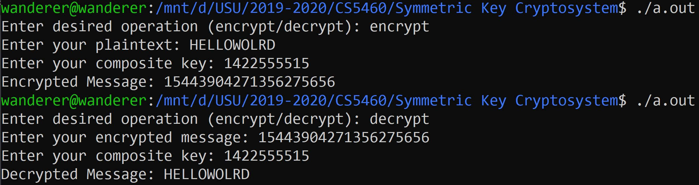

## Description

This program utilizes a few Symmetric Key Cryptography techniques 
in order to encrypt / decrypt a message given a composite key.

## Encryption / Decryption

Techniques used:
* Polybius Square
* Columnar Transposition
* One Time Pad

### Encryption Process

Input: i) Composite Key, ii) Plaintext Message (non case-sensitive)

Output: Ciphertext Message

Let's assume that the Composite Key is: 1422555515
Here, the key for one-time pad is 15 (last number consisting of two digits). The previous part of
the composite key: 14225555 will be used to generate a key for columnar transposition, using a
polybius square, where each number consists of two digits. So, we have the following numbers:
14, 22, 55, 55. Now, we will use the following polybius square (fixed) to get
the key for columnar transposition, which in this case, would be: BALL

Polybius Square:
--| 0 | 1 | 2 | 3 | 4 | 5
--|---|---|---|---|---|---
**0** | E | Y | O | P | D | 9  
**1** | 2 | H | Q | X | 1 | I  
**2** | R | 3 | A | J | 8 | S  
**3** | F | 0 | N | 4 | G | 5  
**4** | Z | B | U | V | C | T  
**5** | M | 7 | K | W | 6 | L  

Now, we will use this key: BALL to encrypt the given plaintext message using Columnar
Transposition (No Padding is needed).

Let’s note the output of Columnar Transposition as cipher1. In the second step, cipher1 will be
encrypted using One-time Pad. To do so, use the given polybius square to find the numerical
representation for each letter in cipher1 (like, you will get 43 for G), convert each number
(consisting of two digits) to the corresponding 6-bit binary value (e.g., we will get a binary value:
001011 for the decimal number: 11), and then implement one-time pad crypto technique upon
converting the key to its binary value (in this example, ‘15’ would be converted to ‘001111’).
Implement one-time pad crypto technique individually for each letter in cipher. Then convert
each 6-bit binary number to the corresponding decimal number, which would represent the final
output of the encryption process.

Let’s assume, cipher1 is: ERFZM. So, the polybus square would give us the following numbers:
00, 02, 03, 04, 05. The binary representation would be: 000000, 000010, 000011, 000100,
000101. Using key: 15 (001111) for one-time pad encryption, we get the following ciphertext for
ERFZM by performing XOR operation: 001111, 001101, 001100, 001011, 001010. So, the
corresponding decimal numbers would be: 15, 13, 12, 11, 10. Thus, if cipher1 is ERFZM, the
final ciphertext would be: 1513121110

## Sample

